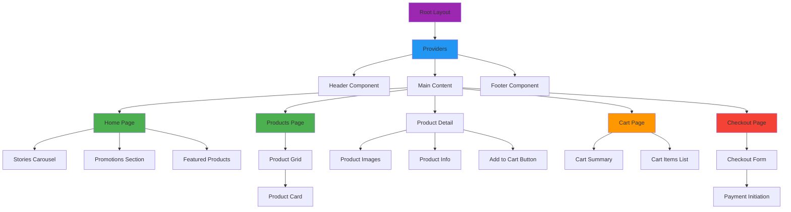
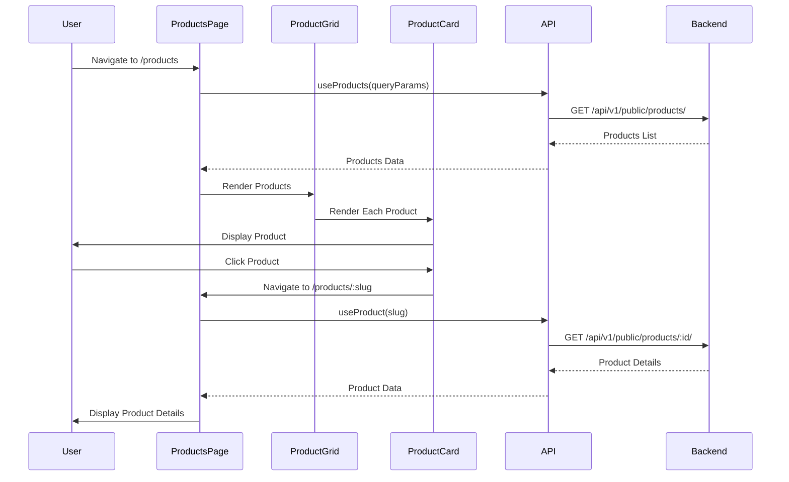
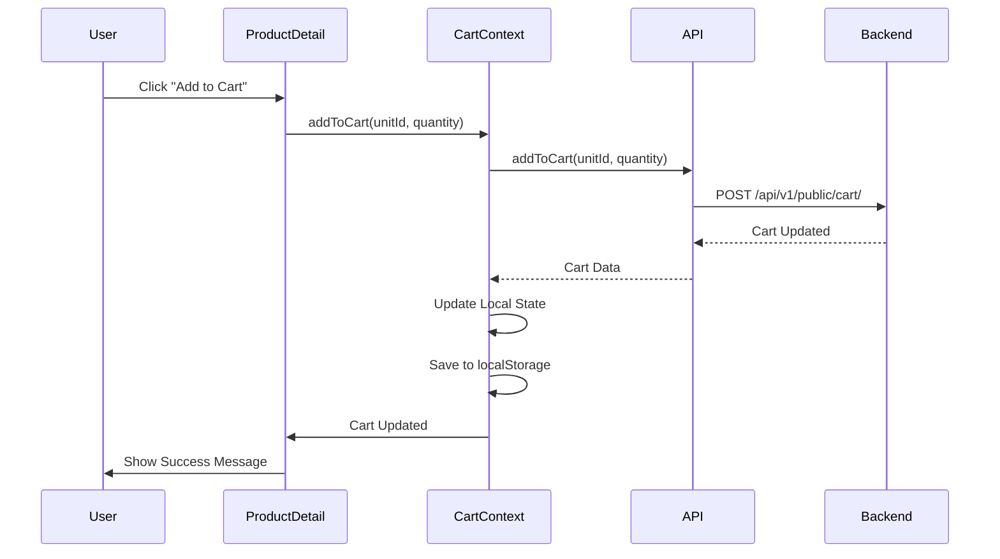
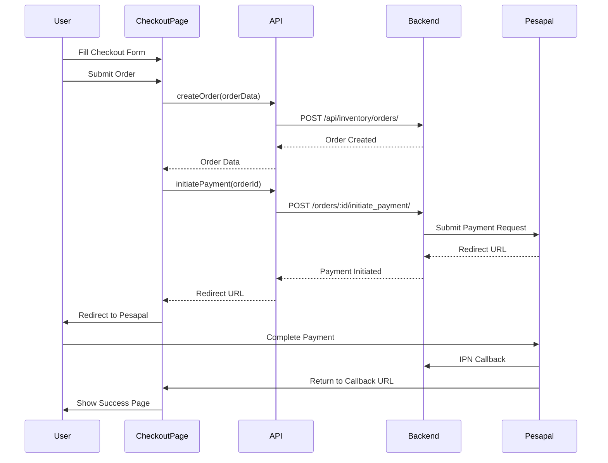

# Frontend Architecture Documentation

Complete architecture documentation for the Affordable Gadgets E-commerce Frontend (Next.js).

---

## Table of Contents

1. [Application Structure](#application-structure)
2. [Component Hierarchy](#component-hierarchy)
3. [State Management](#state-management)
4. [API Integration](#api-integration)
5. [Routing](#routing)
6. [Data Flow Diagrams](#data-flow-diagrams)

---

## Application Structure

### Technology Stack

- **Framework**: Next.js 14 (App Router)
- **Language**: TypeScript
- **Styling**: Tailwind CSS
- **State Management**: React Query (TanStack Query)
- **API Client**: Generated from OpenAPI spec
- **Deployment**: Vercel

### Directory Structure

```
app/
├── layout.tsx              # Root layout
├── page.tsx                # Homepage
├── globals.css             # Global styles
├── providers.tsx           # Context providers
├── products/               # Product pages
│   ├── page.tsx           # Product listing
│   └── [slug]/            # Product detail
│       └── page.tsx
├── cart/                  # Shopping cart
│   └── page.tsx
├── checkout/              # Checkout flow
│   └── success/
│       └── page.tsx
├── payment/              # Payment pages
│   ├── [orderId]/
│   ├── callback/
│   ├── success/
│   └── cancelled/
├── promotions/           # Promotions page
│   └── page.tsx
├── orders/               # Order tracking
│   └── [orderId]/
│       └── page.tsx
├── budget-search/        # Budget search
│   └── page.tsx
├── match-score/          # Match score calculator
│   └── page.tsx
└── reviews/              # Reviews page
    └── page.tsx

components/
├── Header.tsx
├── Footer.tsx
├── ProductCard.tsx
├── ProductGrid.tsx
├── CartSummary.tsx
├── StoriesCarousel.tsx
└── ...

lib/
├── api/                  # API client functions
├── hooks/                # React Query hooks
├── utils/                # Utility functions
└── config/               # Configuration
    └── brand.ts
```

---

## Component Hierarchy

### High-Level Component Structure



### Component Details

#### Header Component
- **Location**: `components/Header.tsx`
- **Responsibilities**:
  - Navigation menu
  - Brand logo
  - Cart icon with count
  - Search functionality
  - User menu (if authenticated)

#### Footer Component
- **Location**: `components/Footer.tsx`
- **Responsibilities**:
  - Footer links
  - Contact information
  - Social media links
  - Brand information

#### ProductCard Component
- **Location**: `components/ProductCard.tsx`
- **Props**:
  - `product`: Product data object
  - `onClick`: Click handler
- **Displays**:
  - Product image
  - Product name
  - Price range
  - Stock availability
  - Interest count
  - Rating

#### StoriesCarousel Component
- **Location**: `components/StoriesCarousel.tsx`
- **Features**:
  - Auto-advancing stories (5s default)
  - Manual navigation
  - Progress indicators
  - Supports promotions, reviews, videos

#### CartSummary Component
- **Location**: `components/CartSummary.tsx`
- **Displays**:
  - Cart items list
  - Subtotal
  - Total amount
  - Checkout button

---

## State Management

### React Query (TanStack Query)

Primary state management for server state.

#### Query Hooks

```typescript
// Product queries
useProducts(queryParams)
useProduct(id)
useProductBySlug(slug)

// Cart queries
useCart()
useAddToCart()
useUpdateCartItem()
useRemoveFromCartItem()

// Promotion queries
usePromotions()
usePromotion(id)

// Order queries
useOrder(orderId)
useOrderStatus(orderId)
```

#### Query Configuration

```typescript
// Default query options
{
  staleTime: 5 * 60 * 1000, // 5 minutes
  cacheTime: 10 * 60 * 1000, // 10 minutes
  refetchOnWindowFocus: false,
  retry: 1
}
```

### Context Providers

#### Cart Context
- **Location**: `app/providers.tsx`
- **Purpose**: Client-side cart state
- **Storage**: localStorage (session-based)
- **Features**:
  - Add to cart
  - Remove from cart
  - Update quantities
  - Clear cart
  - Persist across page reloads

#### Brand Context
- **Location**: `lib/config/brand.ts`
- **Purpose**: Brand configuration
- **Features**:
  - Brand code
  - Brand name
  - API base URL
  - Brand colors
  - Brand logo

---

## API Integration

### API Client Structure


### API Client Functions

**Location**: `lib/api/`

#### Public API Client
```typescript
// Products
export async function getProducts(params)
export async function getProduct(id)
export async function getProductBySlug(slug)

// Cart
export async function getCart()
export async function addToCart(unitId, quantity)
export async function updateCartItem(itemId, quantity)
export async function removeCartItem(itemId)

// Promotions
export async function getPromotions()
export async function getPromotion(id)

// Budget Search
export async function searchByBudget(params)
```

### Request Headers

All API requests automatically include:
```typescript
headers: {
  'X-Brand-Code': 'AFFORDABLE_GADGETS',
  'X-Session-Key': sessionKey, // if available
  'X-Customer-Phone': customerPhone, // if available
  'Content-Type': 'application/json'
}
```

### Error Handling

```typescript
try {
  const data = await apiCall();
  return data;
} catch (error) {
  if (error.response?.status === 401) {
    // Handle unauthorized
  } else if (error.response?.status === 404) {
    // Handle not found
  } else {
    // Handle other errors
  }
  throw error;
}
```

---

## Routing

### App Router Structure (Next.js 14)

```mermaid
graph TB
    Root["Root /"] --> Home["Home Page /"]
    Root --> Products["Products /products"]
    Root --> ProductDetail["Product Detail /products/:slug"]
    Root --> Cart["Cart /cart"]
    Root --> Checkout["Checkout /checkout"]
    Root --> Payment["Payment /payment/:orderId"]
    Root --> PaymentCallback["Payment Callback /payment/callback"]
    Root --> PaymentSuccess["Payment Success /payment/success"]
    Root --> PaymentCancelled["Payment Cancelled /payment/cancelled"]
    Root --> Orders["Orders /orders/:orderId"]
    Root --> Promotions["Promotions /promotions"]
    Root --> BudgetSearch["Budget Search /budget-search"]
    Root --> MatchScore["Match Score /match-score"]
    Root --> Reviews["Reviews /reviews"]
    
    style Root fill:#9c27b0
    style Home fill:#4caf50
    style Products fill:#2196f3
    style Cart fill:#ff9800
    style Checkout fill:#f44336
```



### Route Details

| Route | Page Component | Purpose |
|-------|---------------|---------|
| `/` | `app/page.tsx` | Homepage with stories, promotions, featured products |
| `/products` | `app/products/page.tsx` | Product listing with filters |
| `/products/[slug]` | `app/products/[slug]/page.tsx` | Product detail page |
| `/cart` | `app/cart/page.tsx` | Shopping cart |
| `/checkout` | `app/checkout/page.tsx` | Checkout form |
| `/checkout/success` | `app/checkout/success/page.tsx` | Checkout success |
| `/payment/[orderId]` | `app/payment/[orderId]/page.tsx` | Payment initiation |
| `/payment/callback` | `app/payment/callback/page.tsx` | Payment callback handler |
| `/payment/success` | `app/payment/success/page.tsx` | Payment success |
| `/payment/cancelled` | `app/payment/cancelled/page.tsx` | Payment cancelled |
| `/orders/[orderId]` | `app/orders/[orderId]/page.tsx` | Order tracking |
| `/promotions` | `app/promotions/page.tsx` | Promotions listing |
| `/budget-search` | `app/budget-search/page.tsx` | Budget-based search |
| `/match-score` | `app/match-score/page.tsx` | Product match calculator |
| `/reviews` | `app/reviews/page.tsx` | Reviews listing |

---

## Data Flow Diagrams

### Product Browsing Flow



### Add to Cart Flow



### Checkout Flow



---

## Performance Optimization

### Image Optimization
- Next.js Image component for automatic optimization
- Cloudinary CDN for product images
- Lazy loading for below-fold images

### Code Splitting
- Automatic route-based code splitting
- Dynamic imports for heavy components
- Tree shaking for unused code

### Caching Strategy
- React Query caching for API responses
- Static page generation where possible
- ISR (Incremental Static Regeneration) for product pages

---

## SEO Implementation

### Meta Tags
- Dynamic meta tags per page
- Open Graph tags for social sharing
- Twitter Card tags

### Structured Data
- Product schema markup
- Organization schema
- Breadcrumb schema

### Sitemap & Robots
- Dynamic sitemap generation (`app/sitemap.ts`)
- Robots.txt configuration (`app/robots.ts`)

---

## Environment Configuration

### Environment Variables

```env
NEXT_PUBLIC_BRAND_CODE=AFFORDABLE_GADGETS
NEXT_PUBLIC_BRAND_NAME=Affordable Gadgets
NEXT_PUBLIC_API_BASE_URL=https://api.example.com
```

### Brand Configuration

**Location**: `lib/config/brand.ts`

```typescript
export const brandConfig = {
  code: process.env.NEXT_PUBLIC_BRAND_CODE,
  name: process.env.NEXT_PUBLIC_BRAND_NAME,
  apiBaseUrl: process.env.NEXT_PUBLIC_API_BASE_URL,
  // ... other brand settings
}
```

---

## Deployment

### Vercel Deployment

1. Connect GitHub repository to Vercel
2. Configure environment variables
3. Set build command: `npm run build`
4. Set output directory: `.next`
5. Deploy automatically on push to main branch

### Build Process

```bash
npm run build    # Production build
npm start        # Start production server
npm run dev      # Development server
```

---

*Last Updated: $(date)*
